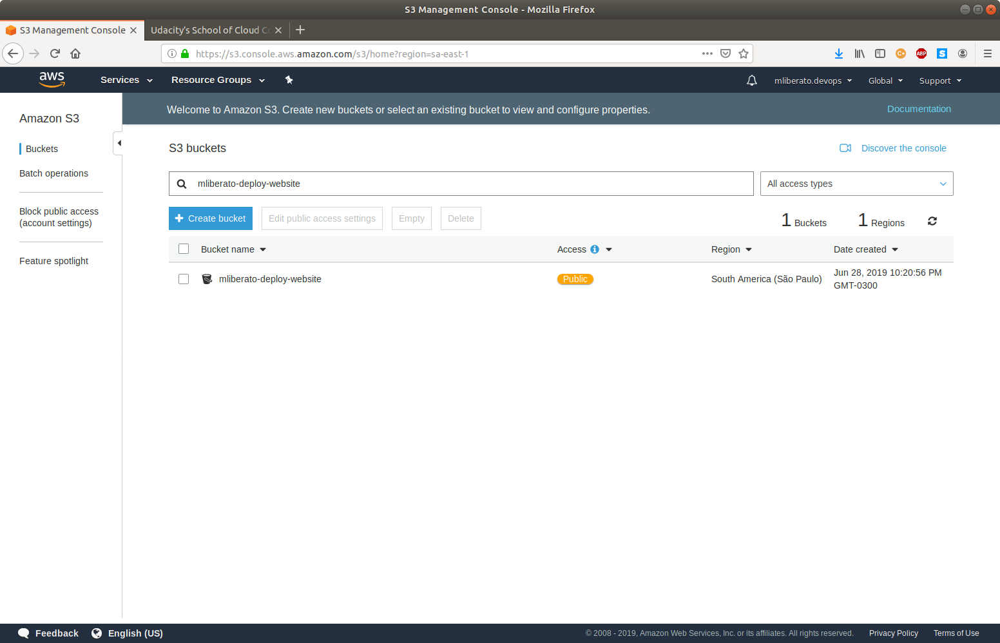
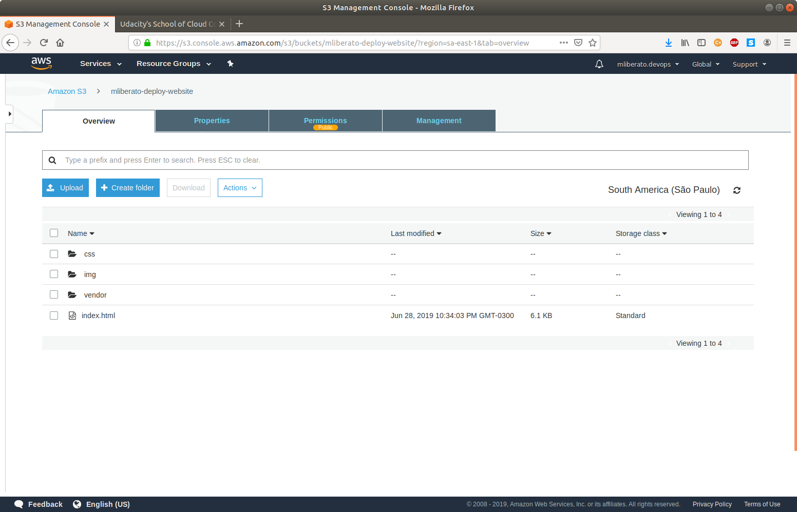
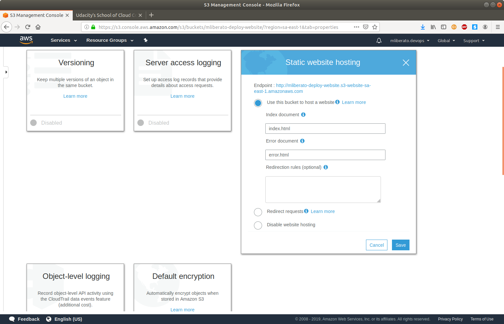
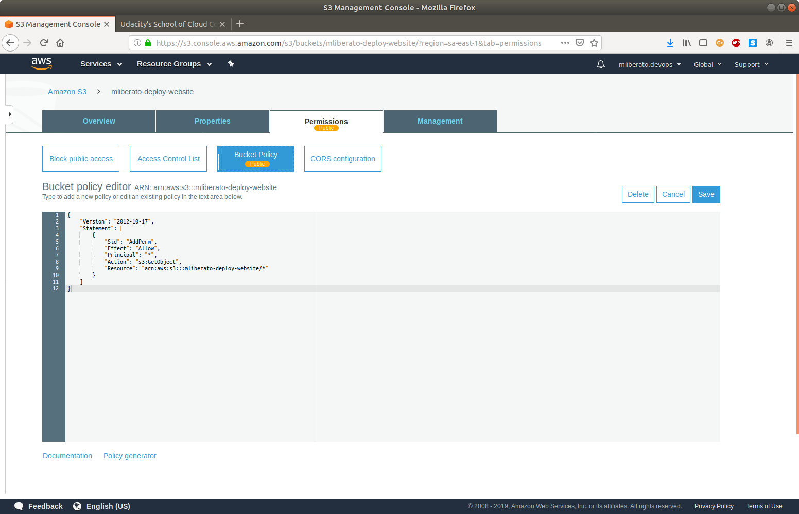
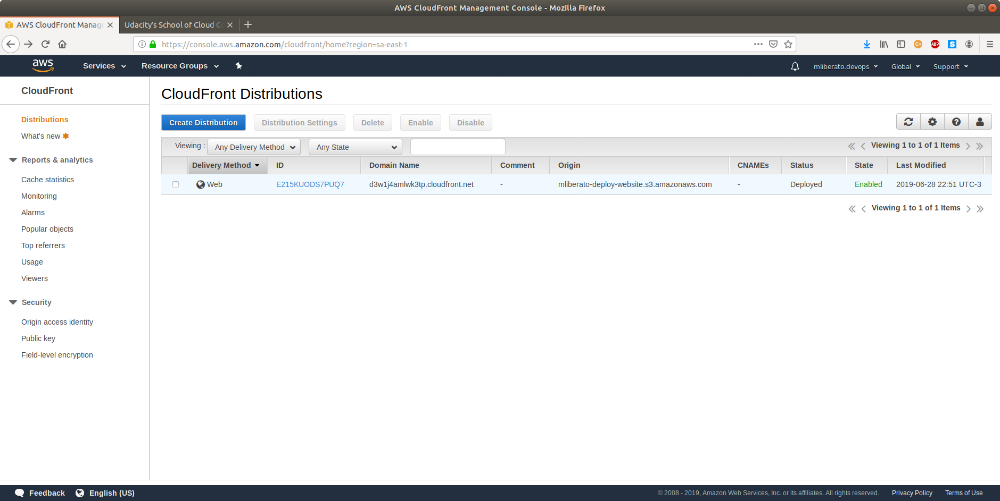
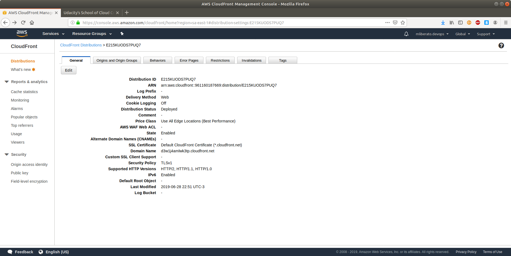

# Screenshots

#### S3 Bucket created.

#### All files uploaded to S3 Bucket.

#### S3 Bucket property set to `Static website hosting`.

#### IAM policy settting permission to get website content.

#### CloudFront

#### CloudFront in details

#### Website accessed using a web browser.

