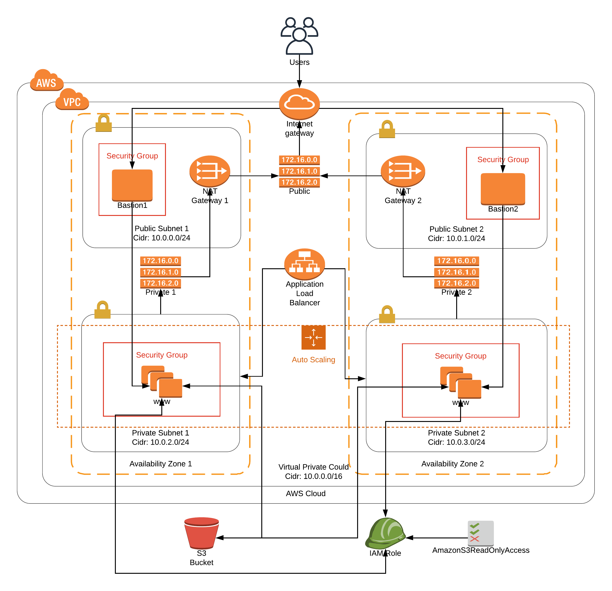

# Deploy a high-availability web app using CloudFormation

This project deploys a high-availability web app using CloudFormation to AWS Cloud.

## Instructions

The infrasctructure necessary to run the Udagram application on AWS Cloud is splited in three files: *infrasctructure.yml*, *bastion.yml* and *servers.yml*. In order to deploy the whole infrasctructure this scripts need to be runned one by one as below:

To deploy the infrasctructure with Subnets, InternetGateway and etc, run the following command:

    ./create.sh udacityproject-infrastructure infrastructure.yml infrastructure.json

To deploy the bastion host inside public subnet and its repective security groups, run:

    ./create.sh udacityproject-bastion bastion.yml bastion.json

Lastly, to deploy the web application and its configs run the following command:

    ./create.sh udacityproject-servers servers.yml servers.json

It's all!

## Note for reviewer.

There is a requirement in project specification saying to remove the KeyName property from LaunchConfiguration before sending the final version.

> **SSH Key**
There shouldn’t be a ‘keyname’ property in the launch config

However, in order to make bastion hosts working properly (being able to connect into a EC2 Instance running inside private subnets) is necessary to set the SSH key that will be used for authentication. So, the KeyName property in LaunchConfiguration is there intentionally.

To connect into an instance in a private subnet is necessary connect first into any of the bastion hosts. It could be done running the following command:

    ssh-add privatekey.pem
    ssh -A ubuntu@bastion-public-ip

The first command `ssh-add privatekey.pem` is runned only once. It adds the SSH private key to ssh-agent. The second command connect to bastion host with `-A` option which enables forwarding of the authentication agent connection. This way the private key is stored only in the client machine (laptop) which is good practice from security point of view.

Lastly, once into bastion host, the following command could be executed to connect into private instance:

    ssh ubuntu@instance-private-ip

The bastion.yml script also create the necessary security groups to restrict the access to/from bastion hosts.
